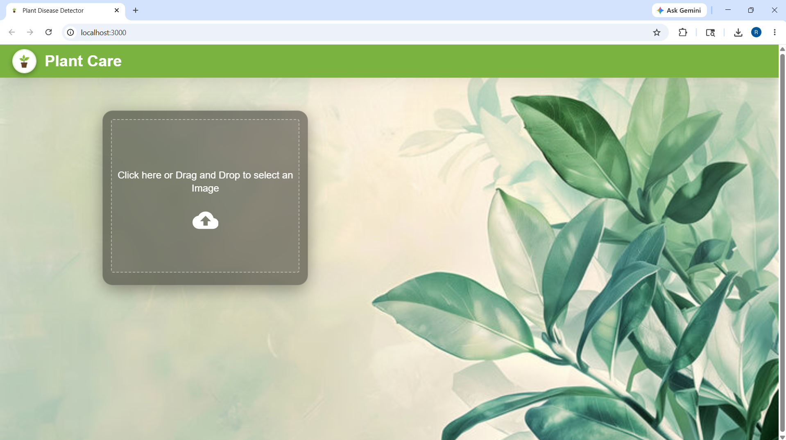
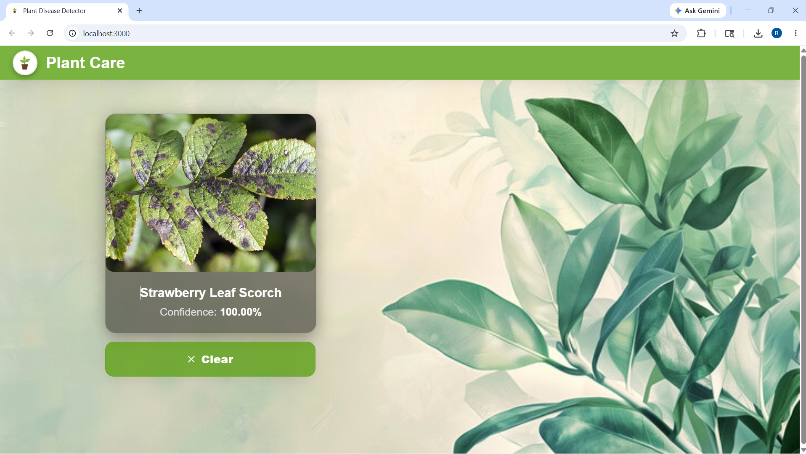
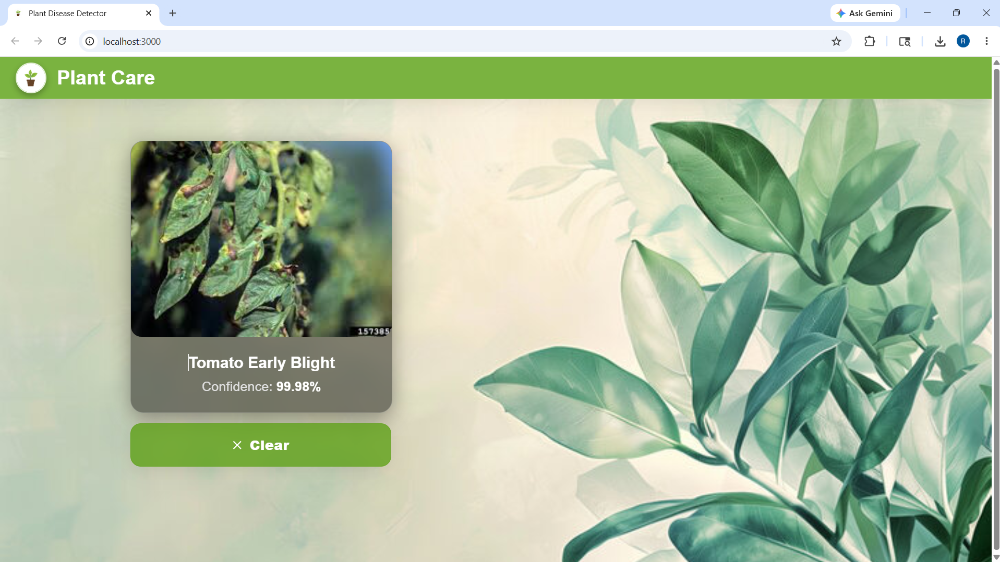

**System Architecture and Technical Specification**

The Plant Disease Detection System is engineered to identify foliar diseases using a Convolutional Neural Network (CNN). To accommodate diverse deployment environments, the system is structured into two distinct operational models.

**1. Unified Hosted Architecture (Streamlit)**
Designed for cloud-hosted environments, this monolithic model tightly couples the user interface, data pre-processing, and inference logic.

* **Workflow:**
* **Data Ingestion:** The client uploads an image via the web interface.
* **Validation (Gatekeeper Phase):** The system applies HSV color space masking to verify natural green hues. Subsequently, a pre-trained MobileNetV2 model cross-references the image against a predefined blacklist to reject non-plant objects.
* **Inference:** Validated images are resized to 224x224 pixels and processed by the primary CNN.
* **Output:** The system extracts the highest probability class and dynamically renders the classification with a confidence progress bar.

* **Technology Stack:** Python, Streamlit, TensorFlow/Keras, Pillow, NumPy.

## Live Deployment
The hosted application is available for direct access: 
[Plant Disease Detection System - Live App](https://plant-disease-detection-from-leaf-images-cnn-rohanth33.streamlit.app/#plant-care-ai)

**2. Decoupled Full-Stack Architecture (React + FastAPI)**
Designed for scalable, local, or microservice environments, this client-server model separates the presentation layer from the computational logic.

* **Workflow:**
* **Data Ingestion:** The React application captures the file and issues a multipart/form-data POST request.
* **Processing:** The FastAPI backend receives the binary payload, decodes it into a standard RGB array, and applies necessary tensor preprocessing.
* **Inference:** The tensor is fed into the backend-loaded CNN for classification.
* **Output:** The backend returns a JSON payload containing the predicted class and confidence score to the client for rendering.

* **Frontend Technology Stack:** React.js, Material-UI (UI components and Dropzone), Axios (HTTP client).
* **Backend Technology Stack:** Python, FastAPI (REST API), Uvicorn (ASGI server), TensorFlow/Keras.

## Application Output

### Initial Upload Screen

### Disease Classification Result

**Core Machine Learning Engine (Shared)**
Both deployment models utilize the same underlying inference engine. The primary CNN is trained on the PlantVillage dataset, capable of classifying 39 distinct health conditions across 14 crop species, and is stored using the TensorFlow SavedModel protocol buffer format.
